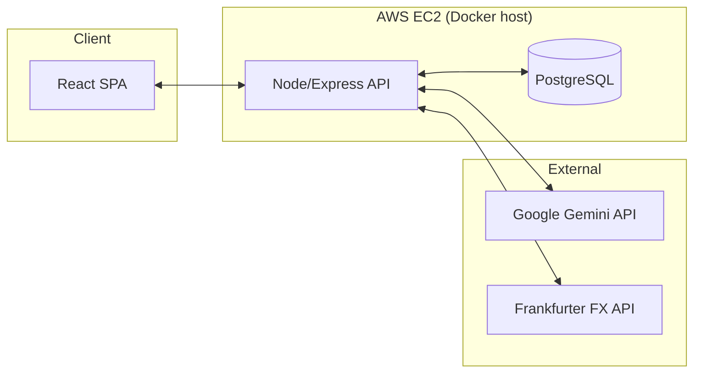
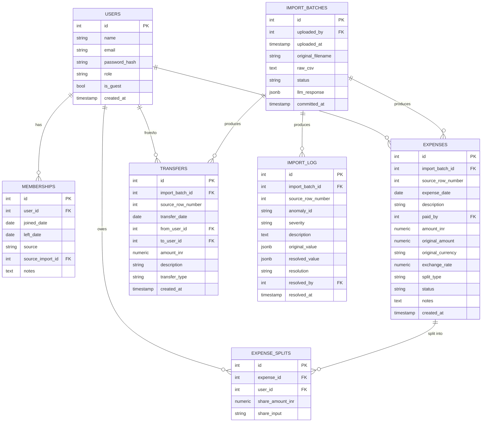
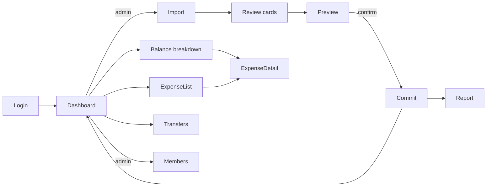
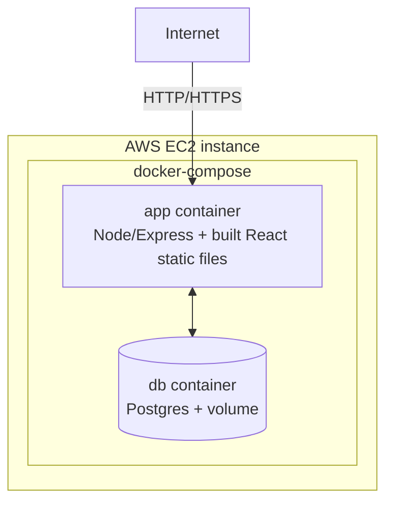

# Flatmate Ledger — Design Document

> Working name: **Flatmate Ledger** (placeholder — rename freely before bootstrapping the repo)

This document is the single source of truth for the application design, agreed
upon before any code is written. It covers personas, anomaly handling policy,
architecture, data flow, database schema, API design, frontend flows, and
deployment. Once finalized, this doc seeds `SCOPE.md` and `DECISIONS.md`.

---

## 1. Overview & Goals

A shared-expense tracker for **one flat**. Flatmates (permanent or temporary
guests) log shared expenses. The app computes who owes whom, in INR, with a
full audit trail back to source data.

### In scope
- Single flat, single shared ledger (no multi-group support)
- CSV import as the primary data-entry mechanism, with a robust anomaly
  pipeline
- Pairwise balance calculation (not minimum-cash-flow)
- Drill-down from any balance to the exact expenses that produced it
- USD → INR conversion using historical, date-of-expense exchange rates
- Settlements/transfers tracked separately from expenses
- Admin-gated review of any ambiguous import decision
- Downloadable import report (PDF/CSV)

### Out of scope
- Multiple flats/groups per deployment
- Minimum-cash-flow settlement suggestions
- Manual hand-editing of the source CSV before import (explicitly disallowed)
- Real-time/live FX rates (historical, date-based rate only)

---

## 2. Personas → Requirements Traceability

| Persona | Request | Feature(s) addressing it |
|---|---|---|
| Aisha | "One number per person. Who pays whom, how much, done." | Dashboard: pairwise net balances, one row per relationship |
| Rohan | "No magic numbers — show exactly which expenses make up my balance." | Balance drill-down page; `expense_splits` table stores per-person share for every expense |
| Priya | "The sheet pretends a dollar is a rupee. That can't be right." | Deterministic FX conversion step using historical rates, logged per row |
| Sam | "Why would March electricity affect my balance?" | Membership-aware split computation — a user only appears in `expense_splits` for expenses dated within their membership window |
| Meera | "I want to approve anything the app deletes or changes." | Two-section import review: auto-fixed log (read-only) + review cards (admin must resolve before commit) |

---

## 3. Tech Stack

| Layer | Choice | Notes |
|---|---|---|
| Frontend | React (Vite) + TailwindCSS + React Router | SPA, served as static build |
| Backend | Node.js + Express | REST API |
| ORM | Prisma | Migrations + type-safe queries against Postgres |
| Database | PostgreSQL | Satisfies the relational DB requirement |
| Auth | JWT (access token) + bcrypt | Stateless auth, roles embedded in token |
| LLM | Gemini API (Google AI Studio), `gemini-1.5-flash` or `gemini-1.5-pro`, forced structured JSON output | Classification/interpretation only — never arithmetic |
| FX rates | [frankfurter.app](https://www.frankfurter.app/) | Free, no API key, historical daily rates |
| PDF generation | `pdfkit` | Import report export |
| CSV parsing | `csv-parse` | Raw CSV ingestion |
| Containerization | Docker + docker-compose | App + Postgres containers |
| Hosting | AWS EC2 (free-tier credits) | `docker-compose up` on a single instance |

---

## 4. System Architecture



Single EC2 instance runs two containers via docker-compose: `app` (Node API +
serves the built React app as static files) and `db` (Postgres with a
persistent volume). Gemini and Frankfurter are external HTTPS calls made
server-side only — no API keys ever reach the browser.

---

## 5. Anomaly Catalog & Resolution Policy

Every anomaly below was found in `expenses_export.csv`. Each is assigned an ID
(used later in the import log / report), a detection method, and a bucket:

- **AUTO** — deterministic backend code fixes it. Logged in Section 1
  (read-only, no admin action needed).
- **CARD** — surfaced as a review card in Section 2. Admin must pick an
  option before commit. LLM may *propose* a recommendation, but the decision
  is the admin's.

| ID | Anomaly | Row(s) | Bucket | Policy |
|---|---|---|---|---|
| A1 | Duplicate expense — "Dinner at Marina Bites" vs "dinner - marina bites", same date/amount/payer | 3, 4 | CARD | LLM flags as likely duplicate (date+amount+payer match, near-identical description). Admin picks: keep row 3 / keep row 4 / keep both. |
| A2 | Conflicting duplicate — "Dinner at Thalassa" (₹2400, Aisha) vs "Thalassa dinner" (₹2450, Rohan), note says Aisha's may be wrong | 22, 23 | CARD | LLM detects duplicate + reads note on row 23 to pre-select "keep row 23 (₹2450)" as the recommendation. Admin confirms or overrides. |
| A3 | Settlement logged as an expense — "Rohan paid Aisha back", note explicitly questions this | 12 | CARD | LLM classifies as likely settlement based on description + note. Admin picks: record as Transfer (excluded from balances) / keep as Expense. Default recommendation: Transfer. |
| A4 | Negative amount — "Parasailing refund" (-30 USD) | 24 | AUTO | Policy: a negative amount on an otherwise-normal row is treated as a **credit/reversal** against the same split — i.e. it reverses a portion of the original Parasailing expense's shares for the same people. Logged with before/after amounts. |
| A5 | Zero amount — "Dinner order Swiggy", note says "counted twice earlier - fixing later" | 29 | AUTO | Zero-amount rows are **voided** — imported with `status='void'`, excluded from all balance calculations, but retained for audit. |
| A6 | Amount with thousands separator — `"1,200"` | 5 | AUTO | Strip non-numeric separators before parsing. Logged as a formatting fix. |
| A7 | Excess decimal precision — `899.995` | 8 | AUTO | Round to 2 decimal places (standard currency precision). Logged with original vs rounded value. |
| A8 | Missing currency | 26 | AUTO | Default to `INR` (the flat's home currency). Logged explicitly so it's auditable, not silent. |
| A9 | USD amounts treated as face-value INR — Goa trip expenses | 18, 19, 21, 24 | AUTO | For each USD row, fetch the **historical INR rate for that row's date** from frankfurter.app, convert, and store both `original_amount`/`original_currency` and the converted `amount_inr` + `exchange_rate` used. Logged per row with the rate. |
| A10 | Missing payer — "House cleaning supplies", note says "can't remember who paid" | 11 | CARD | No data exists to infer this. Admin picks payer from the member list, or marks the expense as having "no payer" (cost is split but nobody is owed — effectively a write-off). |
| A11 | Inconsistent name casing/whitespace — `"priya"`, `"rohan "` | 7, 25 | AUTO | Normalize: trim whitespace, title-case, then exact-match against known member names. Both resolve unambiguously to `Priya` and `Rohan`. Logged as normalization. |
| A12 | Ambiguous payer identity — `"Priya S"` | 9 | CARD | Does not exact-match any known member after normalization. LLM proposes "likely `Priya`" (fuzzy string similarity), but admin must confirm — this is an identity claim about money, not a formatting fix. |
| A13 | Non-standard date format — `"Mar-14"` vs `DD-MM-YYYY` elsewhere | 25 | AUTO | Parser tries a fallback list of date formats (`MMM-DD`, etc.) before giving up. `Mar-14` → `14-03-2026` (year inferred from surrounding rows' year). Logged as a format fix. |
| A14 | Genuinely ambiguous date — `"04-05-2026"`, note explicitly asks "April 5 or May 4?" | 32 | CARD | Both `DD-MM-YYYY` and `MM-DD-YYYY` are valid readings. Cannot be resolved by a rule without risking a silent wrong answer. Admin picks: 5 April 2026 / 4 May 2026. |
| A15 | Departed member still in split — Meera in an April 2 grocery split, note admits "oops" | 34 | CARD | The app has no membership calendar to consult (see §6.4). LLM detects a *pattern*: Meera appears in nearly every Feb/Mar split, then drops out entirely in April except this row, and row 31's note ("Meera farewell dinner... moving out Sunday") suggests why. It flags row 34 as inconsistent and recommends removing Meera. Admin confirms or overrides. |
| A16 | Deposit logged as expense — "Sam deposit share" (₹15,000, Sam → Aisha) | 36 | CARD | LLM classifies based on description + note ("paid Aisha his deposit"). Admin picks: record as Transfer (excluded from balances, but visible to both parties) / keep as Expense. Default recommendation: Transfer. |
| A17 | External guest in split — "Dev's friend Kabir" in the parasailing split | 21 | CARD | Kabir is not a flatmate and has no account. Admin picks: split among flatmates + Dev only (Kabir's implied share folded back into the total being split among the rest) / include Kabir's share in Dev's share (Dev absorbs it) — **per earlier agreement, the latter is the house default**, but still surfaced for confirmation since it changes Dev's amount. |
| A18 | Percentage split doesn't sum to 100% — Aisha 30 / Rohan 30 / Priya 30 / Meera 20 = 110% | 13, 30 | AUTO | Policy: **normalize proportionally** — scale each percentage by `100/sum` so ratios are preserved and the total is exactly 100%. (30/30/30/20 → ≈27.3/27.3/27.3/18.2). Logged prominently with original and normalized percentages, since this directly changes amounts owed. |
| A19 | `split_type` / `split_details` conflict — row says `equal` but `split_details` has per-person shares | 40 | AUTO | Policy: **`split_type` is authoritative**. `equal` wins; `split_details` is ignored for computation but retained in the row's stored notes for traceability. Logged explaining the conflict and the resolution. |

That's **19 anomaly types across 21 affected rows** — well above the "at
least 12" requirement, with every one detected, surfaced, and handled per an
explicit, documented policy. Nothing is silently guessed; nothing crashes the
import.

---

## 6. Import Pipeline — Detailed Design

### 6.1 Pipeline Stages

```mermaid
flowchart TD
    A[Admin uploads CSV] --> B[Create import_batch row\nstore raw CSV text]
    B --> C[Stage 1: Deterministic pre-processor]
    C --> C1[Parse rows]
    C1 --> C2[Clean amounts: strip commas, round decimals]
    C2 --> C3[Normalize dates: multi-format parser]
    C3 --> C4[Normalize names: trim/case, match known members]
    C4 --> C5[Default missing currency to INR]
    C5 --> C6[FX conversion via Frankfurter for USD rows]
    C6 --> C7[Handle zero/negative amounts]
    C7 --> C8[Normalize percentage splits to 100%]
    C8 --> C9[Resolve split_type vs split_details conflicts]
    C9 --> D[Write Section 1 entries to import_log\nseverity = auto_fixed]
    D --> E[Stage 2: LLM classification pass]
    E --> E1[Send cleaned rows + known members\n+ system prompt to Gemini]
    E1 --> E2[Gemini returns review_items:\nduplicates, settlement/transfer\nclassification, membership\ninconsistencies, identity matches,\nambiguous dates - each with\nstructured options + recommendation]
    E2 --> F[Write Section 2 entries to import_log\nseverity = review_required, status = pending]
    F --> G[Frontend: Review screen]
    G --> G1[Section 1: read-only auto-fix log]
    G --> G2[Section 2: cards, admin picks an option per item]
    G2 --> H[Admin submits all decisions]
    H --> I[Stage 3: Deterministic application]
    I --> I1[Apply each decision: exclude/merge/reclassify rows]
    I1 --> I2[Compute expense_splits per split_type formula]
    I2 --> I3[Update import_log: resolution, resolved_by, resolved_at]
    I3 --> J[Preview screen: final expense table]
    J --> K{Admin confirms commit?}
    K -->|No, edit a decision| G
    K -->|Yes| L[Write expenses, expense_splits,\ntransfers to DB]
    L --> M[Generate import report - PDF + CSV]
    M --> N[Mark import_batch committed]
```



### 6.2 Stage boundaries — why this split

- **Stage 1 (deterministic)** handles everything where the "right answer" is
  a pure function of the data: formatting, units, currency conversion, math.
  No external dependency is required for these — they work even if the LLM
  API is down.
- **Stage 2 (LLM)** handles *interpretation*: "do these two rows describe the
  same event?", "does this description+note read like a settlement?", "does
  this person's presence pattern look like a membership change?". This is
  exactly what LLMs are good at and regex/heuristics are bad at.
- **Stage 3 (deterministic)** takes the admin's decisions — which are always
  a choice from a **closed set of options**, never free text — and applies
  them with backend code. **All money math (split computation, FX, rounding,
  normalization) happens here and in Stage 1, never inside the LLM call.**
  This is what makes Rohan's "no magic numbers" guarantee possible: every
  number in `expense_splits` can be traced to a formula in version-controlled
  code, with the LLM's role limited to "which formula / which rows" — never
  "what number."

### 6.3 LLM call — structured output contract

**Input to Gemini:**
- The Stage-1-cleaned rows (JSON), including original row numbers
- The current member list (names, guest flag, any known join/leave info from
  prior imports — see §6.4)
- A system prompt describing the categories of issue to look for and the
  exact JSON schema to return (enforced via Gemini response schema / structured output,
  so the response is guaranteed valid JSON, not prose)

**Output schema (`review_items`):**
```json
{
  "review_items": [
    {
      "id": "string",
      "type": "duplicate | settlement_or_transfer | missing_payer | ambiguous_date | membership_inconsistency | identity_match | external_guest",
      "row_refs": [3, 4],
      "summary": "human-readable description for the card",
      "options": [
        { "id": "keep_row_3", "label": "Keep row 3" },
        { "id": "keep_row_4", "label": "Keep row 4" },
        { "id": "keep_both", "label": "Keep both" }
      ],
      "recommended_option_id": "keep_row_4"
    }
  ]
}
```

The admin's response is simply `{ "item_id": "...", "chosen_option_id": "..." }`
for each item — a closed-set selection, never free text, which is what Stage 3
applies deterministically.

### 6.4 Membership data — how it's actually tracked

As discussed: the CSV has no membership calendar, and predicting future
join/leave dates isn't possible. The resolution:

- The system does **not** maintain a predictive membership calendar.
- Membership facts are derived **only from admin decisions made during
  import review** (e.g., resolving A15 by choosing "remove Meera from this
  split" creates a record: *"as of the import reviewed on [date], Meera does
  not participate in expenses dated 2-Apr-2026 or later"*).
- These derived facts are stored in the `memberships` table and are fed back
  into future imports' LLM prompts as known context — so if a second CSV
  export later also contains Meera in a May split, the LLM already knows she
  left and can flag it with higher confidence (still as a CARD, never
  silently).
- A `/members` settings page lets the admin view and manually adjust these
  records directly, independent of any import.

### 6.5 Resilience — if the LLM is unavailable

The import must never hard-depend on an external API for "must not crash."
If the Gemini API call fails or times out:

- Stage 1 still runs fully (it's all local code) and its auto-fixes are
  logged normally.
- Stage 2 falls back to a **conservative heuristic classifier**:
  - Possible duplicate: same date + same payer + amount within ±5% +
    description similarity (Levenshtein ratio) above a threshold → flagged.
  - Possible settlement/transfer: description or notes contain keywords like
    "paid back", "settlement", "deposit" → flagged.
  - Any row whose normalized payer/participant name doesn't exactly match a
    known member → flagged as identity_match.
  - Any date matching multiple valid format interpretations → flagged as
    ambiguous_date.
- These heuristic flags become review cards with no `recommended_option_id`
  (admin chooses with no suggestion). The import proceeds; nothing is lost.
- The import log records whether each Stage-2 item came from `llm` or
  `heuristic_fallback`, for transparency in the report.

---

## 7. Database Schema



### Table notes

- **`users`** — every flatmate and guest (Dev, Kabir) gets a row. Guests have
  `is_guest = true` and typically no login credentials (`password_hash`
  nullable, `role = 'guest'`) — they exist purely so `expense_splits` can
  reference them.
- **`memberships`** — derived facts about who participates in expenses over
  what date range, populated from admin decisions during import (see §6.4) or
  manual edits via `/members`. `source` is `'import'` or `'manual'`.
- **`import_batches`** — one row per CSV upload. `raw_csv` retains the
  original file verbatim (proof of what was imported). `status` moves
  `pending_review → committed` (or `aborted`).
- **`import_log`** — the anomaly audit trail. Every row in §5's table becomes
  one or more `import_log` entries here. This table *is* the source data for
  the Import Report. `severity` is `auto_fixed` or `review_required`;
  `resolved_by` is `NULL` for auto-fixed entries.
- **`expenses`** — the cleaned, canonical expense record. `amount_inr` is
  always the final INR amount used for splitting; `original_amount` /
  `original_currency` / `exchange_rate` are retained for USD rows (A9).
  `status` is `active`, `void` (A5), or `excluded_duplicate` (A1/A2 losers).
- **`expense_splits`** — one row per (expense, participant). `share_amount_inr`
  is the computed amount that participant owes for that expense — this is
  what powers Rohan's drill-down. `share_input` retains the raw split spec
  (e.g. `"30%"`, `"2 shares"`, `"700"`) for display.
- **`transfers`** — settlements (A3) and deposits (A16). Excluded from
  `expense_splits`-based balance math, but shown in a dedicated `/transfers`
  view and **netted into the final pairwise balance** (a settlement directly
  changes what's owed between two people).

### Balances — computed, not stored

Pairwise balances are computed on read from `expense_splits` + `transfers`:

```sql
-- For each expense, the payer is owed share_amount_inr by every other
-- participant. Aggregate per ordered pair (debtor, creditor):
SELECT
    es.user_id AS debtor_id,
    e.paid_by  AS creditor_id,
    SUM(es.share_amount_inr) AS amount
FROM expense_splits es
JOIN expenses e ON e.id = es.expense_id
WHERE e.status = 'active'
  AND es.user_id != e.paid_by
GROUP BY es.user_id, e.paid_by

UNION ALL

-- Transfers reduce what the sender owes the receiver
SELECT from_user_id, to_user_id, -amount_inr
FROM transfers;
```

The API layer nets each `(A,B)` / `(B,A)` pair down to a single signed value
("A owes B ₹X" or "B owes A ₹X") for the dashboard, while retaining the
underlying `expense_splits` rows for drill-down.

---

## 8. Split Calculation Engine

All four `split_type`s, computed deterministically in Stage 1/3 — never by the
LLM.

| split_type | Formula | Worked example |
|---|---|---|
| `equal` | `amount_inr / count(split_with)` per person | ₹1200 ÷ 4 people = ₹300 each |
| `percentage` | `amount_inr * (normalized_pct / 100)` per person | ₹1440, Aisha 30→27.27%, Rohan 30→27.27%, Priya 30→27.27%, Meera 20→18.18% (normalized from 110%, A18) → ₹392.7 / ₹392.7 / ₹392.7 / ₹261.8 |
| `share` | `amount_inr * (person_shares / total_shares)` | ₹3600, shares Aisha 1 / Rohan 2 / Priya 1 / Dev 2 = 6 total → ₹600 / ₹1200 / ₹600 / ₹1200 |
| `unequal` | Each person's `share_amount_inr` is the explicit value from `split_details`; validated that `sum(shares) == amount_inr` | ₹1500, Rohan 700 / Priya 400 / Meera 400 = 1500 ✓. Rohan (payer) owes himself nothing → Priya owes Rohan ₹400, Meera owes Rohan ₹400 |

**Validation rule (new, from our `unequal` discussion):** if
`sum(split_details amounts) != amount_inr` for an `unequal` row, this becomes
an additional review card type (`split_mismatch`) — the admin is shown the
gap and can choose to adjust the payer's own share to absorb the difference,
or flag the row for manual amount correction. (Not present in this CSV, but
the engine must handle it if it ever occurs.)

For `equal`/`share`/`percentage`, the **payer is included in `split_with`**
and therefore has their own `expense_splits` row too — their net contribution
is `amount_inr - their_share`, which is what they're "owed" by the group.

---

## 9. API Design

All endpoints under `/api`. Auth via `Authorization: Bearer <JWT>`. `role`
claim in the JWT is `admin` or `member`.

| Method & Path | Auth | Purpose |
|---|---|---|
| `POST /auth/register` | — | Create account (first user becomes admin) |
| `POST /auth/login` | — | Returns JWT |
| `GET /me` | any | Current user profile |
| `GET /users` | any | List all flatmates/guests |
| `POST /members` | admin | Add a new member/guest |
| `PATCH /members/:id` | admin | Update role, guest flag |
| `GET /memberships` | any | List derived membership windows |
| `PATCH /memberships/:id` | admin | Manually adjust joined/left dates |
| `POST /imports` | admin | Upload CSV → runs Stages 1–2, returns batch with auto-fix log + review cards |
| `GET /imports` | admin | List all import batches |
| `GET /imports/:id` | admin | Get batch status, logs, review items |
| `POST /imports/:id/resolve` | admin | Submit chosen options for review items → runs Stage 3, returns preview |
| `POST /imports/:id/commit` | admin | Finalize — write expenses/splits/transfers, generate report |
| `GET /imports/:id/report?format=pdf\|csv` | admin | Download import report |
| `GET /expenses` | any | List committed expenses (filterable by date/person/status) |
| `GET /expenses/:id` | any | Expense detail incl. all `expense_splits` |
| `GET /balances` | any | Pairwise net balances for the whole flat |
| `GET /balances/:userId/breakdown` | any | All `expense_splits` + `transfers` contributing to that user's balances, grouped by counterparty |
| `GET /transfers` | any | List settlements & deposits |

---

## 10. Frontend Pages & User Flows

| Route | Purpose |
|---|---|
| `/login`, `/register` | Auth |
| `/dashboard` | **Aisha's view** — one row per pairwise relationship: "You owe Rohan ₹2,300" / "Priya owes you ₹450", etc. Click → drill-down |
| `/import` | Upload CSV |
| `/import/:id/review` | **Meera's view** — Section 1 (read-only auto-fix log) + Section 2 (review cards, one per `review_item`, with recommended option pre-selected) |
| `/import/:id/preview` | Final expense table after Stage 3 application, before commit |
| `/import/:id/report` | View/download the import report |
| `/expenses` | All committed expenses, filterable |
| `/expenses/:id` | **Rohan's view** — single expense detail with the full per-person split breakdown |
| `/balances/:userId` | **Rohan's drill-down** — "Why do I owe Rohan ₹2,300?" → list of contributing `expense_splits` rows with links to `/expenses/:id` |
| `/transfers` | Settlements & deposits log |
| `/members` | Add/edit flatmates, guests, membership windows |

### Core flow diagram



---

## 11. Import Report Format

Generated at commit time, available as PDF and CSV from
`/imports/:id/report`. Contents, derived entirely from `import_log`:

1. **Header** — batch ID, filename, uploaded by, uploaded at, committed at
2. **Summary** — total rows processed, count auto-fixed, count reviewed,
   count excluded (duplicates/void), final committed expense count, final
   transfer count
3. **Section A — Auto-fixed items** (one row per `import_log` entry with
   `severity = auto_fixed`): source row, anomaly ID, description, original
   value, resolved value
4. **Section B — Reviewed items** (one row per `import_log` entry with
   `severity = review_required`): source row, anomaly ID, description, options
   presented, option chosen, resolved by, resolved at
5. **Section C — Excluded rows** — rows marked `void` or
   `excluded_duplicate`, with reason

---

## 12. Auth & Roles

- JWT contains `{ sub: user_id, role, iat, exp }`. Access token only (no
  refresh token, for simplicity — acceptable for this scope).
- Roles: `admin`, `member`, `guest` (guests typically have no login).
- **Admin reassignment is manual**, not date-driven: an existing admin can
  promote another member to admin via `/members`. When Meera's membership
  ends, Aisha (or whoever) is promoted before/around that time. This avoids
  building date-based role-transition logic for a one-off event.

---

## 13. Deployment Architecture



- Single `docker-compose.yml`: `app` (built from a multi-stage Dockerfile —
  stage 1 builds the React app, stage 2 runs the Express server which also
  serves the static build) + `db` (official `postgres` image with a named
  volume for persistence).
- Env vars (via `.env`, not committed): `DATABASE_URL`, `JWT_SECRET`,
  `GEMINI_API_KEY`.
- Prisma migrations run on container start (`prisma migrate deploy`).
- EC2 security group opens port 80 (and 443 if a domain + TLS is added
  later).

---

## 14. Open Decisions (to carry into DECISIONS.md)

1. **Single-pass LLM vs two-pass** — this doc specifies a single classification
   pass (§6.3) with all arithmetic deterministic. Confirm or revisit.
2. **A17 (Kabir) default** — documented as "Dev absorbs Kabir's share" per
   earlier agreement, but still surfaced as a card since it's a real money
   decision affecting Dev specifically.
3. **A10 (no payer)** — "no payer / write-off" option needs a concrete
   accounting treatment: does the cost simply not appear in anyone's
   `amount_owed`, or is it split among everyone with no one credited? (Leaning
   toward the latter — split among all participants, payer field left
   `NULL`, so the cost is shared but no one is "owed" for fronting it.)
4. **App name** — "Flatmate Ledger" is a placeholder.

---

*End of design document. Once approved, this becomes the basis for
`SCOPE.md` (anomaly log + schema) and `DECISIONS.md` (decision rationale),
both required deliverables.*
