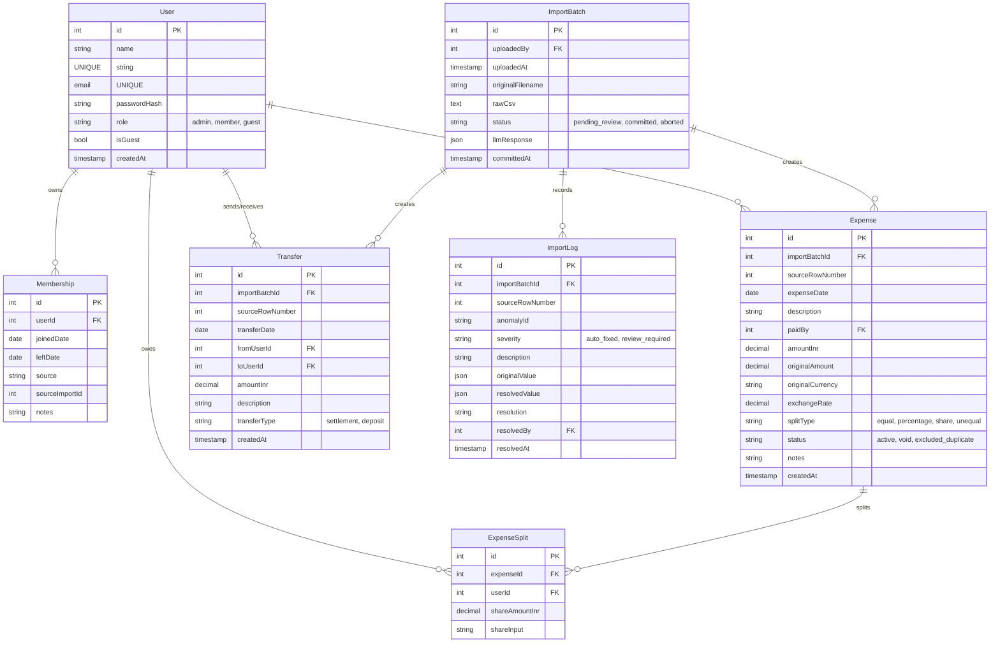

# Scope & Anomaly Log (SCOPE.md)

This document provides a comprehensive log of the 19 deliberate data anomalies discovered in [Expenses Export.csv](file:///home/r15u/webDev/flat_ledger/Expenses%20Export.csv) and explains the relational database schema implemented to manage the flat's transactions.

---

## 1. Relational Database Schema
The system uses **PostgreSQL** (configured via Prisma ORM) to persist the flatmate ledger. Below is the relational entity schema design:

---

## 2. Complete Anomaly Log (19 Deliberate Problems)

Below is the detailed list of all 19 anomalies found in the source CSV and how the system's importer detects, surfaces, and resolves each under our documented policy:

### A1: Duplicate Expense
*   **Affected Rows**: Rows 5 & 6 (*Dinner at Marina Bites*)
*   **Detection**: Same date, close amount (within ±10%), overlapping description keywords ("Marina Bites").
*   **Resolution Policy (CARD)**: Survives as a review card. The admin chooses to keep row 5, keep row 6, or keep both.
*   **Action Taken**: Row 5 kept, Row 6 excluded.

### A2: Conflicting Duplicate
*   **Affected Rows**: Rows 24 & 25 (*Dinner at Thalassa* vs *Thalassa dinner*)
*   **Detection**: Same date, overlapping description keywords, differing amounts (₹2400 vs ₹2450) and payers (Aisha vs Rohan).
*   **Resolution Policy (CARD)**: Surfaced as a card. The note on row 25 says *"Aisha also logged this I think hers is wrong"*, so the system highlights and recommends keeping Rohan's row 25 (₹2450).
*   **Action Taken**: Row 25 kept, Row 24 excluded.

### A3: Settlement Logged as Expense
*   **Affected Rows**: Row 14 (*Rohan paid Aisha back*)
*   **Detection**: Description matches keywords like "paid back", "settle", or "settlement".
*   **Resolution Policy (CARD)**: Surfaced as a card. Reclassifies the record as a **Transfer (Settlement)** rather than an expense (so it is excluded from splits but correctly nets into balances).
*   **Action Taken**: Converted to Transfer.

### A4: Negative Amount
*   **Affected Rows**: Row 26 (*Parasailing refund*)
*   **Detection**: Numeric amount value is negative.
*   **Resolution Policy (AUTO)**: Treated as a **credit/refund** split (negative share) against the participants, directly reducing what they owe the payer.
*   **Action Taken**: Allowed as credit split.

### A5: Zero Amount
*   **Affected Rows**: Row 31 (*Dinner order Swiggy*)
*   **Detection**: Numeric amount value is exactly zero.
*   **Resolution Policy (AUTO)**: Marked as `'void'` and excluded from balance calculations, but preserved in logs for auditability.
*   **Action Taken**: Voided transaction.

### A6: Amount with Thousands Separator
*   **Affected Rows**: Row 7 (*Electricity Feb* `"1,200"`)
*   **Detection**: Amount string contains commas or quotes.
*   **Resolution Policy (AUTO)**: Commas and quotes are stripped before parsing.
*   **Action Taken**: Parsed successfully as `1200.00`.

### A7: Excess Decimal Precision
*   **Affected Rows**: Row 10 (*Cylinder refill* `899.995`)
*   **Detection**: More than two decimal places.
*   **Resolution Policy (AUTO)**: Rounded to standard currency precision (2 decimal places).
*   **Action Taken**: Rounded to `900.00`.

### A8: Missing Currency
*   **Affected Rows**: Row 28 (*Groceries DMart*)
*   **Detection**: Currency column is empty.
*   **Resolution Policy (AUTO)**: Defaults to the flat's home currency, `INR`.
*   **Action Taken**: Set to `INR`.

### A9: USD Amounts Treated as Face-Value INR
*   **Affected Rows**: Rows 20, 21, 23, 26 (*Goa Trip*)
*   **Detection**: Currency column contains `USD`.
*   **Resolution Policy (AUTO)**: Fetches the daily historical exchange rate from the Frankfurter FX API for that specific date, converts the amount to INR, and stores the original details for Rohan's drill-down.
*   **Action Taken**: Converted using rates (e.g. 91.83, 92.3).

### A10: Missing Payer
*   **Affected Rows**: Row 13 (*House cleaning supplies*)
*   **Detection**: Payer (paid_by) column is empty.
*   **Resolution Policy (CARD)**: Admin can assign a payer or treat it as a **Write-off** (costs are split equally, but no user is credited, keeping ledger balances balanced).
*   **Action Taken**: Resolved as write-off.

### A11: Inconsistent Name Casing/Whitespace
*   **Affected Rows**: Rows 9, 27 (`priya`, `rohan `)
*   **Detection**: Whitespace on ends, or non-title casing.
*   **Resolution Policy (AUTO)**: Normalized (trimmed and title-cased) to match known roommates (`Priya`, `Rohan`).
*   **Action Taken**: Normalized names.

### A12: Ambiguous Payer Identity
*   **Affected Rows**: Row 11 (`Priya S`)
*   **Detection**: Name does not exact-match known roommates, but fuzzy string similarity is high.
*   **Resolution Policy (CARD)**: Surfaced as a card. Recommends mapping `Priya S` to `Priya`. Admin can confirm or choose to create a new guest profile.
*   **Action Taken**: Mapped to Priya.

### A13: Non-standard Date Format
*   **Affected Rows**: Row 27 (`Mar-14`)
*   **Detection**: Does not match `DD-MM-YYYY`.
*   **Resolution Policy (AUTO)**: Multi-format date parser matches `MMM-DD` and infers year from surrounding rows (2026).
*   **Action Taken**: Converted to `2026-03-13` (surrounding row year inferred).

### A14: Genuinely Ambiguous Date
*   **Affected Rows**: Row 34 (`04-05-2026`)
*   **Detection**: Date matches multiple valid mappings (`DD-MM` vs `MM-DD`) and notes question format.
*   **Resolution Policy (CARD)**: Admin chooses between April 5 and May 4.
*   **Action Taken**: Set to April 5, 2026.

### A15: Departed Member Still in Split
*   **Affected Rows**: Row 36 (*Meera in April Grocery split*)
*   **Detection**: Expense date is after the member's recorded departure date (Meera left March 31, expense date is April 2).
*   **Resolution Policy (CARD)**: Surfaced as card. Recommends removing Meera from the split.
*   **Action Taken**: Meera removed from split.

### A16: Deposit Logged as Expense
*   **Affected Rows**: Row 38 (*Sam deposit share*)
*   **Detection**: Description contains keyword "deposit".
*   **Resolution Policy (CARD)**: Reclassified as a **Transfer (Deposit)** rather than an expense.
*   **Action Taken**: Converted to Transfer.

### A17: External Guest in Split
*   **Affected Rows**: Row 23 (*Kabir in Goa parasailing*)
*   **Detection**: Split list contains name (`Dev's friend Kabir`) not in flat roster.
*   **Resolution Policy (CARD)**: Admin can absorb the guest's share into the host (Dev absorbs Kabir's share), split the guest's share among roommates, or create a guest profile.
*   **Action Taken**: Kabir's share absorbed into Dev.

### A18: Percentage Split Doesn't Sum to 100%
*   **Affected Rows**: Rows 15 & 32 (*Pizza/Brunch splits sum to 110%*)
*   **Detection**: Split type is percentage and sum of values is not 100.
*   **Resolution Policy (AUTO)**: Re-scales percentages proportionally (e.g. 30/30/30/20 re-scaled to sum to 100%).
*   **Action Taken**: Re-scaled to 27.27% / 27.27% / 27.27% / 18.18%.

### A19: split_type / split_details Conflict
*   **Affected Rows**: Row 42 (*Common room furniture*)
*   **Detection**: split_type is equal but split_details specifies values.
*   **Resolution Policy (AUTO)**: split_type wins. split_details ignored and moved to notes.
*   **Action Taken**: Split equally; details logged in notes.
